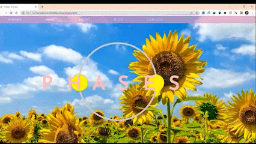
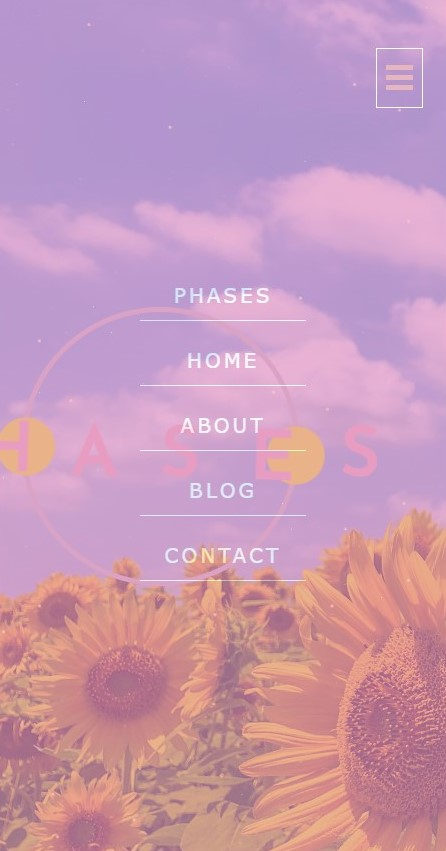

# Phases

  👾 
~ I am currently working on this project of mine. I came up with the design myself, as well as the name and idea of the entire page. These are some initial results of my work. I was doubting to make a portfolio, but I guess my CV is pretty good enough 😜

~ The goal of this project is to create an interactive and user-friendly web application that provides a seamless user experience through a single-page layout.

~ still in its early stages

~ however, I wanted to improve my skills while also making it responsive and visually appealing.

